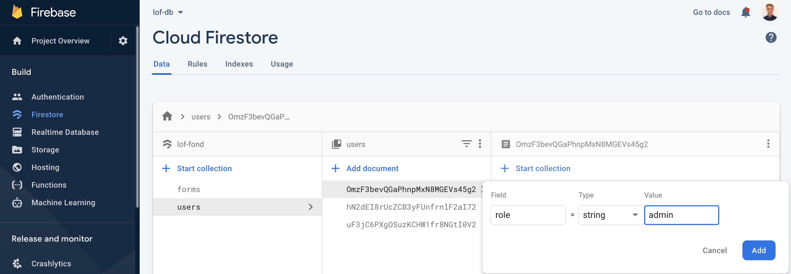

# Dokumentation for Løfbergs og Fennings Fonden

## Ved overførsel af system

Overfør admin rights af Firebase db, Netlify, ..?

Overfør opsætningen fra Heroku til Any.Cloud's appdeployment service.

- Niels skal tage stilling til om både frontend og backend skal lagres på Heroku/Netlify hvor der så skal betales, eller om den skal serviceres fra Any.Cloud.

Opret admin bruger til Emil & Niels.

## Nødvendige links

- Database - Firebase db: https://console.firebase.google.com/u/0/project/lof-fond/firestore/data~2Fforms~2FgWocfPsdXxfX49sCnZgL
- CMS - Strapi: https://github.com/jepras/lof-strapi & https://loffond.herokuapp.com/admin/
- Hosting
  - Hosting backend - Heroku: https://dashboard.heroku.com/apps
  - Hosting frontend - Netlify:
- URL deployed til: https://lof-fond.netlify.app/

## Forklaring

På **Firebase** lagres alle formularer, brugere og de filer de har uploadet.
Under henholdsvis Firestore, Authentication & Storage.

På **Strapi** kan teksten på hjemmesiden ændres. Alt bortset fra "Ansøgningsskema".

På **Heroku** ligger Strapi app'en deployet.
På **Netlify** ligger front end app'en deployet.

## Frontend (det der kan ses i web applikationen)

### Start app

npm run start

### Admin system

Når du har en bruger med "role = admin", så kan du se et link til /oversigt i øverste bar på hjemmesiden (til højre for Log af)

## Back end (det bagvedliggende)

### Start app

yarn develop

### Send Grid

### Admin system

For at oprette en admin bruger skal du:

1. Gå ind på https://console.firebase.google.com/u/0/project/lof-fond/firestore/data~2Fforms
2. Lokaliser den ønsket bruger under users/form-id.
3. Add field: role = admin.
   

### Slet bruger og al relateret data

For at slette al data skal der gøres følgende 2 ting.

#### På app'en

Vælg "Slet" og bekræft under den ønskede bruger.

#### I Firebase Authentication

1. Find brugeren under [Authentication på Firebase](https://console.firebase.google.com/u/0/project/lof-fond/authentication/users). Scroll eller brug søgefunktionen.
2. Lokaliser de 3 prikker i højre side.
   
3. Vælg Delete account.

### Database opbygning (Firestore)

Når brugeren opretter sig, så skabes der et dokument under /users.
Når brugeren begynder at udfylde ansøgningen og gemmer, så lagres denne information under brugerens dokument under /users.
Når brugeren indsender ansøgningen, så skabes der et endeligt dokument under /forms.
Dette dokument bliver derefter opdateret med en beslutning når en admin foretager en beslutning.
